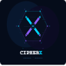

<div align="center">
  

  <h1>🔐 CipherX</h1>
  <h3>Premium Cryptography Visualizer</h3>

  <p><b>A high-fidelity, performance-optimized Flutter application showcasing classical encryption algorithms through an immersive Cyberpunk aesthetic.</b></p>

  <p>
    <a href="https://flutter.dev/"></a>
    <a href="https://dart.dev/"></a>
    <a href="#-architecture--tech-stack"></a>
    <a href="#-architecture--tech-stack"></a>
    <a href="#"></a>
  </p>
</div>

<br/>

> **CipherX** is an interactive educational sandbox designed to breathe life into classical cryptography. Unlike basic converters, CipherX visualizes the *process* of encryption with an animated step-by-step breakdown. Built to production-ready standards, it features complex animations, reactive states, and a stunning "cyber-glass" design system.

---

## 📱 Screenshots

<p align="center">
  
  
  
  
</p>

<div align="center">
  
  
  
  
</div>

---

## ✨ Core Features & UX

| Feature | Description |
| :--- | :--- |
| **🛡️ Crypto Visualization** | Real-time shifting with animated brute-force visualization and adaptive Tabula Recta matrices. |
| **🎨 Visual Excellence** | Curated harmonious palettes featuring *Neon Cyan*, *Deep Purple*, and *Forest Green*. |
| **🕹️ Dynamic Interaction** | Micro-animations on every touchpoint—scaling selectors, glowing borders, and smooth list centering. |
| **🪞 Glassmorphism** | Multi-layered circular glass elements with real-time blur and frosted UI components. |
| **🌍 Bilingual Engine** | Native English (LTR) and Arabic (RTL) support with dynamic regex validation and localization via **Slang**. |
| **🌓 Dynamic Themes** | Persistent Light/Dark modes with synchronized animated gradients. |

---

## 🏗 Architecture & Tech Stack

CipherX is engineered using a robust **Feature-First Clean Architecture**, ensuring deep separation of concerns and limitless scalability. 

<div align="center">

| Component | Technology Used | Purpose |
| :--- | :--- | :--- |
| **Framework** | **[Flutter 3.5.0+](https://flutter.dev/)** | High-performance, cross-platform rendering |
| **State Mgt.** | **[Bloc / Cubit](https://pub.dev/packages/flutter_bloc)** | Predictable, reactive state emission |
| **Architecture** | **Clean Architecture** | Strict boundaries (Domain ↔ Data ↔ Presentation) |
| **Dependency** | **[GetIt](https://pub.dev/packages/get_it)** | Decoupled service location and dependency injection |
| **Navigation** | **[GoRouter](https://pub.dev/packages/go_router)** | Declarative routing & robust deep-linking capabilities |
| **Localization** | **[Slang](https://pub.dev/packages/slang)** | Type-safe, high-performance i18n implementation |

</div>

---

## 🚀 Quick Start Guide

**1. Clone the repository:**
```bash
git clone https://github.com/your-username/encryption_caeser_vigenere.git
cd encryption_caeser_vigenere
```

**2. Install dependencies and run code generators:**
```bash
flutter pub get
dart run build_runner build --delete-conflicting-outputs
```

**3. Launch the visualizer:**
```bash
flutter run --release
```
> *Note: It is highly recommended to run in `--release` mode to experience the complex animations and glassmorphism smoothly at 60/120fps.*

---

<div align="center">
  <h3><i>"Cryptography is the art of solving mysteries"</i></h3>
</div>
